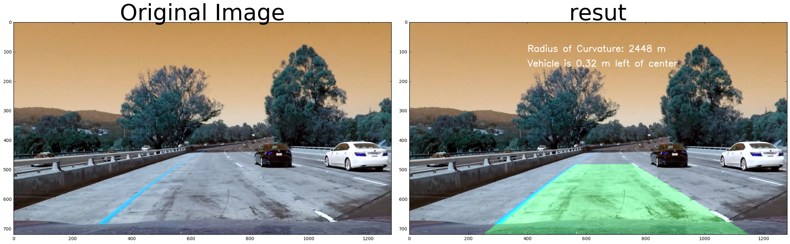

# Project 4 - Advanced Lane Finding

<p align="center">
 <a href="https://www.youtube.com/watch?v=VY1K6rj9TUQ&feature=youtu.be"></a>
 <br>Qualitative results. (click for full video)
</p>

---

**Advanced Lane Finding Project**

The goals / steps of this project are the following:

* Compute the camera calibration matrix and distortion coefficients given a set of chessboard images.
* Apply a distortion correction to raw images.
* Use color transforms, gradients, etc., to create a thresholded binary image.
* Apply a perspective transform to rectify binary image ("birds-eye view").
* Detect lane pixels and fit to find the lane boundary.
* Determine the curvature of the lane and vehicle position with respect to center.
* Warp the detected lane boundaries back onto the original image.
* Output visual display of the lane boundaries and numerical estimation of lane curvature and vehicle position.


Below is the list of techniques used to detect lanes.

- Camera Calibration: Transformation between 2D image points to 3D object points.
- Distortion Correction: Consistent representation of the geometrical shape of objects.
- Perpective Transform: Warping images to effectively view them from a different angle or direction.
- Edge Detection: Sobel Operator, Magnitude Gradient, Directional Gradient, and HLS Color Space with Color thresholding
- Sanity Check: Used Coefficients of Polynomial fittings for parrellel line 


### Camera Calibration


### Pipeline (single images)

#### 1. Provide an example of a distortion-corrected image.

In this step, I used the OpenCV functions `findChessboardCorners` and `drawChessboardCorners` to identify the locations of corners on a series of pictures of a chessboard taken from different angles.

I started by looking for the 9 x 6 chessboard corners in each of the images. 3 of the images did not contain all 9 x 6 corners so those 3 images were skipped. For the other images, the points of the detected corners were saved and used to compute the camera calibration and distortion coefficients.

I then used the output `objpoints` and `imgpoints` to compute the camera calibration and distortion coefficients using the `cv2.calibrateCamera()` function.  I applied this distortion correction to the test image using the `cv2.undistort()` function and obtained this result: 

<p align="center">
 
 <br>Qualitative results. (click for full video)
</p>

#### 2. Describe how (and identify where in your code) you used color transforms, gradients or other methods to create a thresholded binary image.  Provide an example of a binary image result.
In this step I attempted to convert the warped image to different color spaces and create binary thresholded images which highlight only the lane lines and ignore everything else.

<p align="center">
 
 <br>HLS
</p>
The S Channel from the HLS color space, 
<p align="center">
 
 <br>LAB
</p>
The B channel from the Lab color space,
<p align="center">
 
 <br>SOBEL X
</p>
I used an application of a Sobel filter for edge detection in the X direction. After the filter, I also convert the image to binary– each pixel is 'yes' or 'no' depending on the amount of edge detected and a provided threshold. Picking good threshold values is a matter of experimentation and eyeballing. Here's what the same image looks like with the Sobel threshold function applied.
<p align="center">
 
 <br> Combined
</p>
I combined the binary thresholds based on the above mentioned thresholds, to create one which does a good job of highlighting almost all of the white and yellow lane lines.

#### 3. Describe how (and identify where in your code) you performed a perspective transform and provide an example of a transformed image.
 I use OpenCV's getPerspectiveTransform and warpPerspective to change the perspective of the image to a bird's eye view in order to focus directly on the lane lines. This method takes coordinates of input and output quadrilaterals, which are shown below.

| Source        | Destination   | 
|:-------------:|:-------------:| 
| 490, 482      | 0, 0          | 
| 810, 482      | 1280, 0       |
| 1250, 720     | 1250, 720     |
| 40, 720       | 40, 720       |
 
 This is what the image looked like after the perspective transform.
 
<p align="center">
 
 <br> Transform
</p>


#### 4. Describe how (and identify where in your code) you identified lane-line pixels and fit their positions with a polynomial?
I defined one functions called `slidingWindow()` which performs a blind search for the lane lines. The method involves cutting the image into 9 horizontal slices, and for each slice, trying to figure out the X value of the lane lines. This is done by taking a histogram at each slice that counts how many white "yes" pixels there are per X value. The peaks in the histograms should be the locations of the lane lines.

I defined another function called `extract_line()` which performs a targeted search for the lane lines given the previous left and right fitted polynomials from the results of the blind search.

#### 5. Describe how (and identify where in your code) you calculated the radius of curvature of the lane and the position of the vehicle with respect to center.

Next I used the following code to calculate the radius of curvature for each lane line in meters:
```
def find_curvature(yvals, fitx):
    ym_per_pix=30/720 # meters per pixel in y dimension
    xm_per_pix = 3.7/700 # meters per pixel in x dimension
    # Define y-value where we want radius of curvature
    y = np.max(yvals)*ym_per_pix
    radiusCurvature = ((1 + (2*fitx[0]*y + fitx[1])**2)**1.5)/np.absolute(2*fitx[0])
    return radiusCurvature
```
To obtain center offset I evaluate X position of left and right lane polynomials, and find point in the middle (in meters). Then I find the distance from the center of the image (in meters) to that middle of the lane position. That distance is the center offset.
```
def find_position(left,right):
    position = image_shape[1]/2
    ym_per_pix=30/720 # meters per pixel in y dimension
    xm_per_pix = 3.7/700 # meters per pixel in x dimension
    
    left  = left[ (left[:,0] > 700)]
    right = right[ (right[:,0] > 700)]

    minLeft = np.min(left)
    minRight = np.max(right)
    
    laneCentre = (minLeft + minRight)/2
    return (position - laneCentre)*xm_per_pix
```


#### 6. Provide an example image of your result plotted back down onto the road such that the lane area is identified clearly.
<p align="center">
 
 <br> Result
</p>

### Discussion

#### 1. Briefly discuss any problems / issues you faced in your implementation of this project.  Where will your pipeline likely fail?  What could you do to make it more robust?

Most problems come from shadows and noises. This is solved using the averaging of last the 10 fit cofficients to make the land detection more stable. Another important technique used was sanity checking for frame that didnt make sense. This is checked by checking if right and left lane are parrellel within an error and if it is not then these frames are ignored, this solved most of my shadow problem.

There is a lot of rooms for improvement
