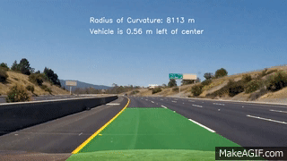
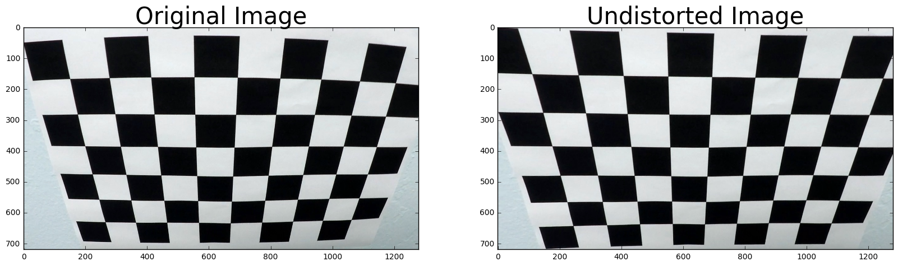
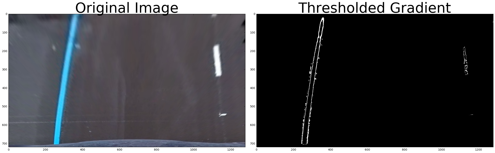
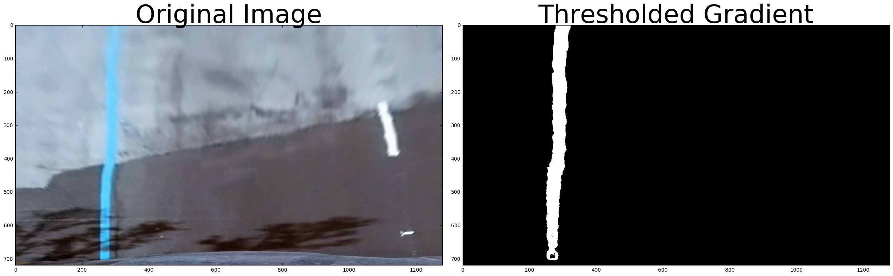
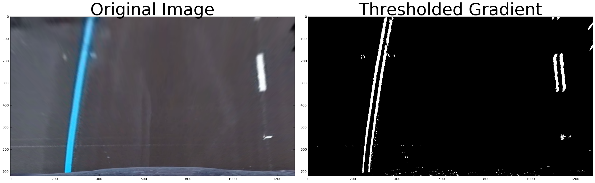
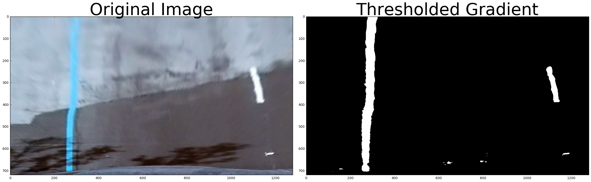
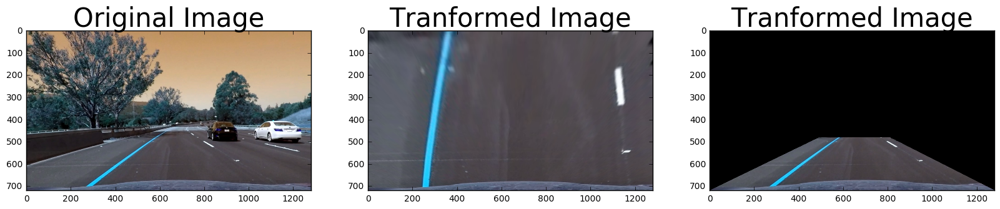

# Project 4 - Advanced Lane Finding

 
  Qualitative results. (click for full video)

---

**Advanced Lane Finding Project**

The goals / steps of this project are the following:

* Compute the camera calibration matrix and distortion coefficients given a set of chessboard images.
* Apply a distortion correction to raw images.
* Use color transforms, gradients, etc., to create a thresholded binary image.
* Apply a perspective transform to rectify binary image ("birds-eye view").
* Detect lane pixels and fit to find the lane boundary.
* Determine the curvature of the lane and vehicle position with respect to center.
* Warp the detected lane boundaries back onto the original image.
* Output visual display of the lane boundaries and numerical estimation of lane curvature and vehicle position.

Below is the list of techniques used to detect lanes.

- Camera Calibration: Transformation between 2D image points to 3D object points.
- Distortion Correction: Consistent representation of the geometrical shape of objects.
- Perpective Transform: Warping images to effectively view them from a different angle or direction.
- Edge Detection: Sobel Operator, Magnitude Gradient, Directional Gradient, and HLS Color Space with Color thresholding
- Sanity Check: Used Coefficients of Polynomial fittings for parrellel line 

### Camera Calibration

### Pipeline (single images)

#### 1. Provide an example of a distortion-corrected image.

 
  Qualitative results. (click for full video)

#### 2. Describe how (and identify where in your code) you used color transforms, gradients or other methods to create a thresholded binary image.  Provide an example of a binary image result.

 
  HLS

 
  LAB

 
  SOBEL X

 
   Combined

#### 3. Describe how (and identify where in your code) you performed a perspective transform and provide an example of a transformed image.

 
   Transform

#### 4. Describe how (and identify where in your code) you identified lane-line pixels and fit their positions with a polynomial?

#### 5. Describe how (and identify where in your code) you calculated the radius of curvature of the lane and the position of the vehicle with respect to center.

#### 6. Provide an example image of your result plotted back down onto the road such that the lane area is identified clearly.

 
   Result

###Discussion

#### 1. Briefly discuss any problems / issues you faced in your implementation of this project.  Where will your pipeline likely fail?  What could you do to make it more robust?
